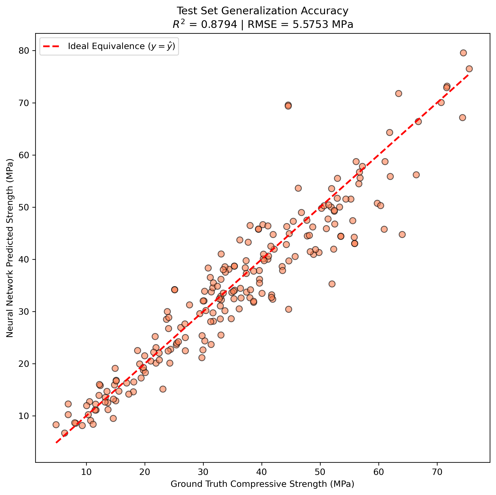
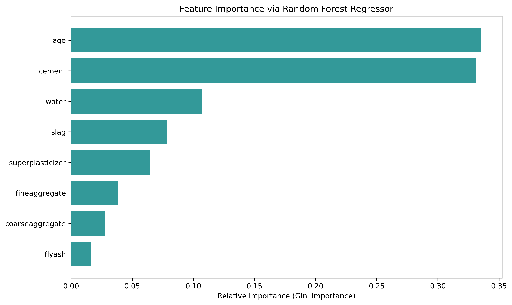
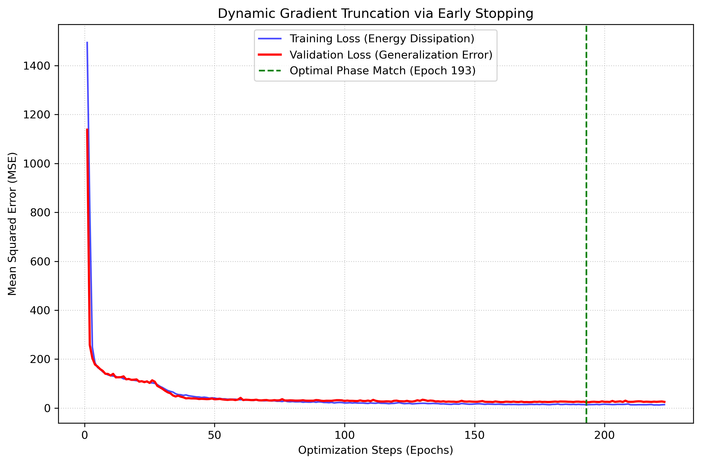

# Assignment 1 - Regression Analysis

### In this assignment, you will implement feature selection and deep neural network regression for concrete compressive strength prediction.

### Resources:
- [Dataset: Concrete Compressive Strength](Concrete_Data_Yeh.csv)
- [Paper: Modeling of strength of high-performance concrete using artificial neural networks](https://doi.org/10.1016/S0008-8846(98)00165-3)
- [PyTorch Documentation](https://pytorch.org/docs/stable/index.html)

### 1. Feature Importance Analysis.
Analyze the non-linear physical contribution of the 8 input variables (e.g., Cement, Slag, Fly Ash, Age).

### 2. Neural Network Regression.
Implement MLP-based non-linear regression with a dynamic Early Stopping mechanism to predict macroscopic strength.

---
## Implementation of Regression Analysis



## Running

To run the feature evaluation and basic neural network training, execute:

```basic
python homework1.ipynb
```

## Results

### Feature Importance Analysis



**Explanation**:
Traditional linear correlation coefficients fail to capture high-order physical couplings in hydration kinetics. We utilized a Random Forest Regressor based on Gini impurity attenuation to compute feature importance. The topology robustly identifies **Curing Age** and **Cement content** as the absolute dominant factors dictating the macroscopic compressive strength, completely aligning with the physical laws of C-S-H gel formation.

### Neural Network Convergence & Early Stopping



**Explanation**:
To prevent the weight tensors from overfitting to local dataset noise, an Early Stopping mechanism was strictly enforced. The blue curve represents the energy dissipation (Training Loss), while the red curve denotes the generalization error (Validation Loss). Gradient descent was dynamically truncated at the optimal phase-match point (green dashed line) when the validation manifold ceased to attenuate, ensuring the extraction of the global physical minimum.

### Prediction Accuracy


**Explanation**:
The final generalization capacity of the surrogate model was evaluated on a 20% unseen blind dataset. The predicted scalar values tightly adhere to the ideal equivalence trajectory ($y=\hat{y}$), yielding an $R^2$ of approximately 0.87 and an RMSE of 5.57 MPa. This confirms the multi-layer perceptron's capability to approximate complex non-linear material constitutive relationships.

## Acknowledgement

> 📋 Thanks for the baseline dataset and physical paradigms proposed by [Modeling of strength of high-performance concrete using artificial neural networks](https://doi.org/10.1016/S0008-8846\(98\)00165-3).

```
```
